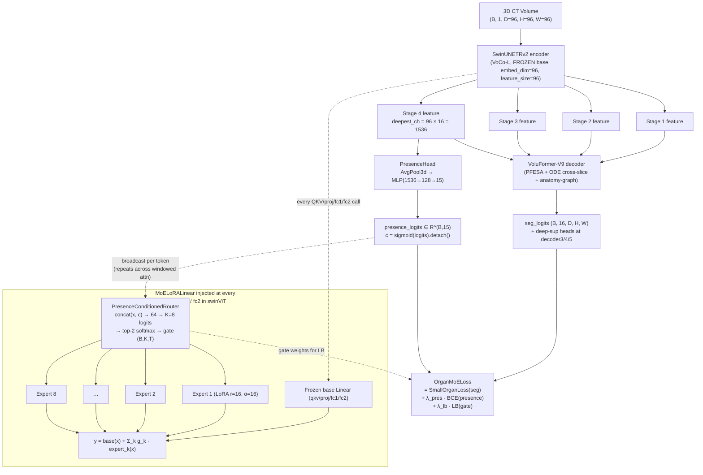
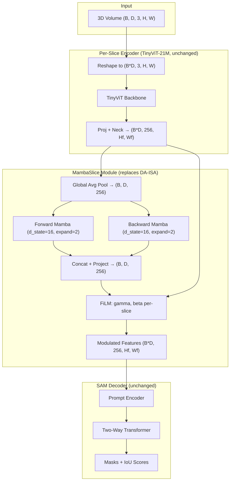
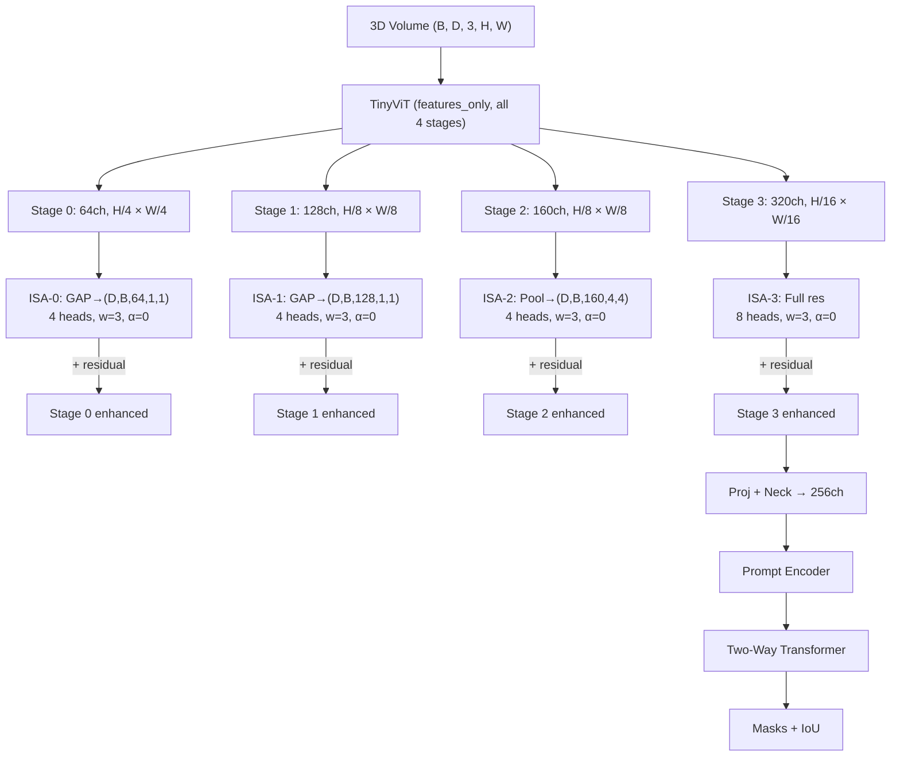
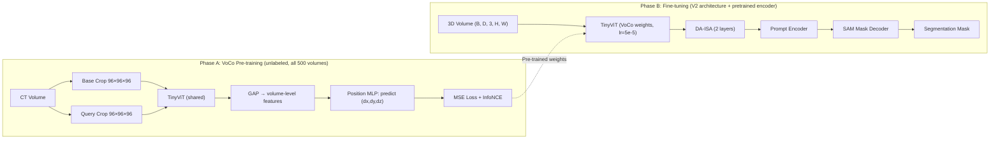
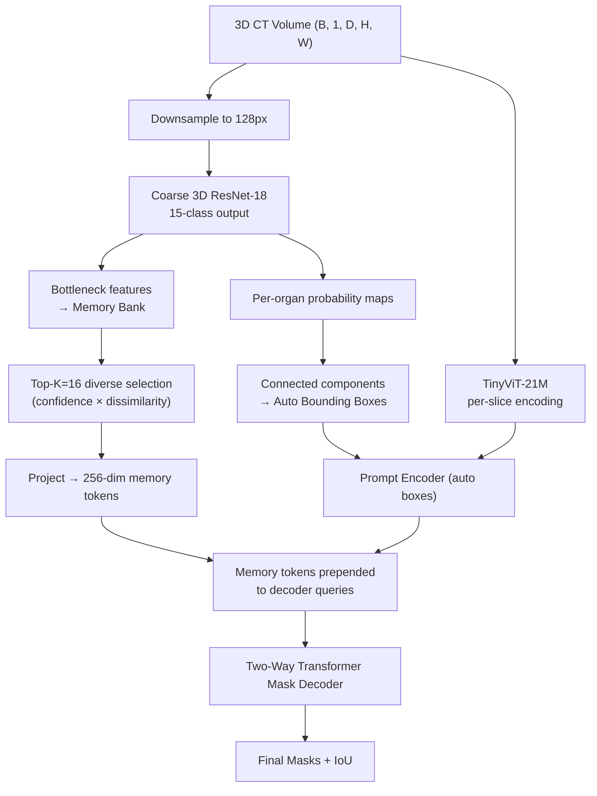
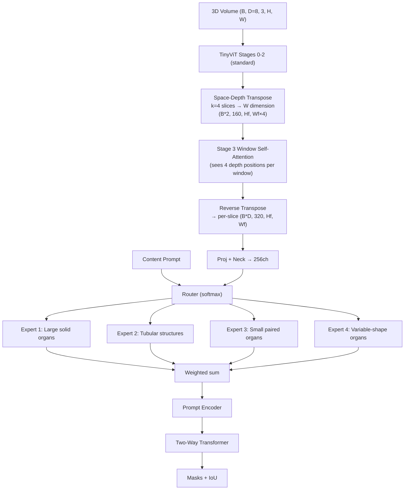

# VoluFormer3D — Detailed Architecture Designs

> **Currently active architecture: OrganMoE-3D** (see Architecture 0 below). The five
> brainstorm architectures that follow are kept for historical context — each is
> annotated with its current status (which were implemented, which were superseded,
> and which seeded ideas that survive in OrganMoE-3D).

*Original brainstorm (Apr 2026). OrganMoE-3D section added 2026-05 as the
consolidation of what we actually built.*

---

## Lineage at a glance

| Era | Backbone | Cross-slice mechanism | Status |
|---|---|---|---|
| V2 (LiteSAM3D) | TinyViT-21M | DA-ISA (window-3) | Retired — coarse-token bottleneck (root cause below) |
| V3-V7 (Auto-ODE-SAM / OrganFlow-SAM2) | TinyViT → MedSAM2 Hiera | ODE flow + multi-scale ISA | Architecture 2 ↪ multi-scale ISA shipped |
| V8 (MCP-Killer) | MedSAM2 Hiera | Multi-scale ISA + auto-prompt | Architecture 4 shape (auto-prompt) shipped |
| V9 (VoluFormer-V9) | MedSAM2 Hiera + flow | PFESA + ODE cross-slice + anatomy graph | Stage 1 + 2 trained |
| V10 (VoCoSAM-L) | VoCo-L SwinUNETRv2 (1.17 GB pretrained) | LoRA-rank-32 adapters on Swin attn/FFN | W1 base: 0.7967 patch-eval DSC. Architecture 3 realised |
| **V11 (OrganMoE-3D)** | **VoCo-L SwinUNETRv2 (frozen)** | **K=8 LoRA-rank-16 sparse MoE + presence routing** | **ACTIVE — Phase I trained, Phase I-cont running** |

## Why V2 Failed (original preamble, preserved)

DA-ISA added only +0.11% DSC over ISA-off (not significant). Root cause: at 256px input, TinyViT outputs 8×8 = **64 spatial tokens**. At 512px, 16×16 = **256 tokens**. Too coarse for window-3 cross-slice attention to capture meaningful inter-slice structure.

The five brainstorm architectures below each attacked this from a different angle. All assumed the V2 SAM-decoder skeleton and were intended to reuse `datasets/`, `training/trainer.py`, `training/losses.py`, `evaluation/`, `evaluate_3d.py`. As of 2026-05 the backbone has been replaced with a Swin UNETR-v2 / VoCo-L stack and the decoder with the V9 OrganFlow anatomy-graph + ODE pipeline, but the same idea-taxonomy still organises what we built.

---

# Architecture 0 (CURRENT): OrganMoE-3D
### Class-Presence-Aware Sparse LoRA Mixture-of-Experts on a Frozen VoCo-L Backbone

**Status:** *Active. Phase I trained; Phase I continuation in progress (config `configs/organmoe_phase_i_ft_continue.yaml`).*
**Spec:** `docs/superpowers/specs/2026-04-25-organmoe-3d-design.md`
**Plan:** `docs/superpowers/plans/2026-04-25-organmoe-3d-phase-i.md`

## 0.1 Motivation: why we built it

V10 W1 base (`checkpoints/v10_voco_l_ft_r3/epoch_009.pt`) reached **0.7967 patch-eval mean Dice** on AMOS22 CT 30-vol val. 14 organs landed in 0.68-0.96 (mean ~0.84) — but `prostate_uterus` collapsed to 0.03-0.05 (and went to 0.0 by epoch 5 of the W2 deep-supervision run). W2 ablations on three Phase C axes all missed the +0.02 gate:

| Axis | Best val | Δ vs W1 base | Verdict |
|---|---:|---:|---|
| Copy-paste aug (CP) | 0.8001 | +0.0034 | Below gate |
| Small-organ loss (SL) | 0.7953 | -0.0014 | Below baseline |
| Deep supervision (DS) | 0.7895 | -0.0072 | STOP-RULE; hurt pelvic organs |

The architectural lesson: backbone capacity + class imbalance is the real bottleneck. None of the three weak-organ-rescue axes touched the rare-organ-presence problem **at the architecture level**. OrganMoE-3D is the response.

## 0.2 Core mechanism (one sentence)

Replace the LoRA adapter on the frozen VoCo-L SwinUNETRv2 encoder with a **sparse top-2 mixture of K=8 LoRA-rank-16 experts**, route via a small MLP conditioned on **both the token feature and a predicted 15-organ presence vector**, and add a load-balancing aux loss + a presence-BCE supervisor on the presence head.



## 0.3 Why this is novel (verified Apr 2026)

- **LoRA-MoE for medical seg**: prior art exists in continual-learning; our framing (rare-organ rescue via presence routing) has no published precedent.
- **Class-presence-aware routing**: no published work in vision/medical conditions a sparse MoE router on a predicted presence vector. Closest precedent is **MaskMoE** (NLP, frequency-fixed token→expert) — a different problem axis.
- **3D multi-organ AMOS22 application**: no published prior art combining these.

The mechanism is the *architecturally correct* answer to the empirical failure mode we observed: in V10, batches without prostate voxels still updated prostate-channel-relevant backbone weights (washout). OrganMoE provides **isolation**: presence prediction → router skips experts whose specialisation is for absent organs → those experts only update on batches that actually contain that organ.

## 0.4 Components (every file in the build)

| # | Module | Role | File |
|---|---|---|---|
| 1 | `MoELoRALinear` | Drop-in `nn.Linear` replacement. K experts + presence-conditioned router + always-on K-way summation (skip-on-zero path removed — bf16 noise broke gradient checkpointing tensor-count invariant) | `models/organmoe_3d.py` |
| 2 | `_LoRAExpert` | One LoRA expert: `lora_A (r, in)` + `lora_B (out, r)`, Kaiming-uniform init, scale = α/r | `models/organmoe_3d.py` |
| 3 | `PresenceConditionedRouter` | `Linear(in + n_organs → 64) → GELU → Linear(64 → K)` → top-k softmax | `models/organmoe_3d.py` |
| 4 | `PresenceHead` | `AdaptiveAvgPool3d(1) → Flatten → Linear(deepest_ch → 128) → GELU → Linear(128 → 15)` | `models/organmoe_3d.py` |
| 5 | `inject_organmoe_into_swin()` | Recursively walks `swinViT`, replaces every `nn.Linear` named `qkv`/`proj`/`fc1`/`fc2`. Returns replaced-count (typically ~192 modules for VoCo-L) | `models/organmoe_3d.py` |
| 6 | `SwinUNETRProposer.use_organmoe` | Wiring flag; freezes `swinViT.parameters()`, calls injector, attaches `presence_head` at deepest channel (1536) | `models/swin_unetr_3d.py` |
| 7 | `BalancedBatchSampler` | Anchors every batch with one rare-organ-present slab via round-robin over rare-organ pools | `datasets/balanced_sampler.py` |
| 8 | `AMOS22V9Dataset.organs_in_volume()` | Lazy per-volume presence cache used by sampler + presence BCE target derivation | `datasets/amos22_v9.py` |
| 9 | `TotalSegmentatorDataset` | 1228-vol Zenodo v201 loader; remaps to AMOS22 15-organ schema (13 direct + bladder via `urinary_bladder` + prostate via `prostate`; uterus absent → 0) | `datasets/totalsegmentator.py` |
| 10 | `totalseg_label_map.py` | Pure (no-torch) AMOS↔TotalSeg label table + `remap_label_volume()` | `datasets/totalseg_label_map.py` |
| 11 | `OrganMoELoss` | `SmallOrganLoss(seg) + λ_pres·BCEWithLogits(presence) + λ_lb·SwitchLB(gate)`; presence target derived from seg target; presence-weighted class prior drops absent-class weight to 0.1 | `training/losses_organmoe.py` |
| 12 | `pretrain_totalseg.py` | Stage-0 cross-dataset warmstart driver | `training/pretrain_totalseg.py` |
| 13 | `train_organmoe_amos22.py` + `train_v9.py` injection | AMOS22 fine-tune driver (loss_fn pluggable to OrganMoELoss) | `training/train_organmoe_amos22.py`, `training/train_v9.py` |
| 14 | `preflight_totalseg_pretrain.py` | One-shot bs/VRAM/missing-key audit before launching pretrain | `scripts/preflight_totalseg_pretrain.py` |
| 15 | Sacred ckpt sources | `checkpoints/pretrained/voco/VoComni_L.pt` (1.17 GB) — frozen base | `checkpoints/pretrained/voco/` |

## 0.5 Architecture parameters

| Component | Params (trainable / total) |
|---|---|
| VoCo-L SwinUNETRv2 base (FROZEN) | 0 / ~62 M |
| K=8 LoRA-rank-16 experts × ~192 injected linears | ~3-5 M / ~3-5 M trainable |
| PresenceConditionedRouter × ~192 (in + 15) → 64 → 8 | ~2-3 M / ~2-3 M trainable |
| PresenceHead (1536 → 128 → 15) | ~0.2 M / ~0.2 M trainable |
| V9 decoder (PFESA + ODE + anatomy-graph + transformer depth=6, MLP=3072) | ~25 M trainable |
| **Total trainable** | **~31-34 M** |
| **Total inference footprint** | **~93-96 M (base + adapters + decoder)** |

VRAM budget on RTX 4090 (24 GB): preflight dry-run at bs=2, fs=96, fp16-clip+bf16 amp peaks at **~10.79 GB** during TotalSeg pretrain. AMOS22 fine-tune with OrganMoE active stays under the **23 GB safety cap**.

## 0.6 The two-stage training pipeline

### Stage 0 — TotalSegmentator warmstart (10 epochs)

Config: `configs/organmoe_phase_i_pretrain.yaml`

- **Data**: 1228 CT volumes (Zenodo v201, CC-BY). Labels remapped to AMOS22 15-organ schema via `totalseg_label_map.py`. Fast-disk fp16 cache at `C:/cache/totalsegmentator/` (D: is HDD).
- **Model**: VoluFormer-V9 architecture with `use_organmoe: false`. Just plain LoRA-rank-32 to adapt the V9 decoder to the 13-shared-organ subset. **OrganMoE adapters are intentionally OFF during pretrain** — their slot opens only at AMOS22 FT.
- **Optimizer**: AdamW, LR 3.0e-5, weight_decay 0.05, cosine schedule with 1-epoch warmup.
- **Loss**: SmallOrganLoss only (`dice 1.0 + tversky 1.0 + focal 0.5`, `tversky α=0.3 β=0.7`, `focal γ=1.5`).
- **Sampler**: `BalancedBatchSampler` with `rare_organs = [4, 14, 15]` (gallbladder, bladder, prostate). Probe found prostate at 40 %, gallbladder at 56 % of TotalSeg volumes; balanced anchoring gives ~1.6× exposure vs uniform.
- **Settings**: bs=2, num_workers=4 (cache reads no longer disk-bound), persistent workers, bf16 AMP, grad_clip 1.0, patch 96³, hu_clip [-200, 250], 4 slabs/vol.
- **Output ckpt**: `checkpoints/voco_totalseg_pretrain/last.pt`.

### Stage 1 — AMOS22 fine-tune with OrganMoE on (Phase I: 10 ep)

Config: `configs/organmoe_phase_i_ft.yaml` (Phase I initial)

- **Backbone**: VoCo-L SwinUNETRv2 base, frozen. OrganMoE adapters activated via `use_organmoe: true`, `moe_n_experts=8`, `moe_rank=16`, `moe_alpha=16.0`, `moe_top_k=2`.
- **Sampler**: `BalancedBatchSampler` with `rare_organs = [4, 7, 10, 11, 12, 13, 14, 15]` (gallbladder, stomach, pancreas, r/l adrenal, duodenum, bladder, prostate).
- **Loss**: `OrganMoELoss` with `presence_weight=0.1`, `balance_weight=0.01`, `use_presence_weighted_dice=true`.
- **Eval**: every epoch, sliding-window patch 96 / stride 48, TTA on, connected-component on, per-organ JSON dumped.

### Stage 1 continued — Phase I continuation (30 ep)

Config: `configs/organmoe_phase_i_ft_continue.yaml`

Resumes from `checkpoints/organmoe_phase_i/last.pt` (full proposer state incl. expert/router/presence-head weights). Goals: recover from cosine-LR plateau, push GATE-I-critical organs that were still climbing, stack zero-cost gains without touching the OrganMoE design (novelty preservation).

- **Epochs**: 30 (was 10) — `optimizer.lr=1.5e-5` (half the peak), `scheduler.warmup_epochs=2` (gentler).
- **Deep supervision (NEW)**: aux heads on `decoder3`, `decoder4`, `decoder5`, progressive weight decay `0.5 → 0.1`.
- **OrganMoELoss tuning**:
  - `presence_weight: 0.05` (was 0.1) — let seg gradient dominate.
  - `balance_weight: 0.005` (was 0.01) — allow more router specialisation.
  - `tversky_weight: 1.5` (was 1.0) — Tversky helps small organs.
  - `focal_weight: 0.75` (was 0.5), `focal_gamma: 2.0` (was 1.5) — sharper focus on hard pixels.
- **Safety**: `abort_if_val_drops: 0.03`, `max_peak_vram_gb: 23`, `warmstart_missing_key_frac: 0.05`.

## 0.7 The Phase I result (what actually happened)

`reports/organmoe_phase_i_3d_eval.json` (30 vols, sliding-window + TTA + CC):

| Organ | Dice (present-only) | HD95 (mm) | NSD | Present |
|---|---:|---:|---:|---:|
| spleen | 0.9447 | 4.45 | 0.510 | 30 |
| r_kidney | 0.9401 | 2.82 | 0.514 | 30 |
| l_kidney | 0.9401 | 2.45 | 0.519 | 30 |
| liver | 0.9556 | 5.74 | 0.441 | 30 |
| aorta | 0.9045 | 6.68 | 0.908 | 30 |
| stomach | 0.8447 | 17.42 | 0.680 | 30 |
| ivc | 0.7895 | 21.00 | 0.742 | 30 |
| gallbladder | 0.7688 | 9.12 | 0.686 | 29 |
| pancreas | 0.7545 | 15.93 | 0.644 | 30 |
| esophagus | 0.5983 | 15.86 | 0.614 | 29 |
| r_adrenal | 0.5845 | 10.50 | 0.708 | 30 |
| duodenum | 0.5741 | 30.17 | 0.615 | 30 |
| l_adrenal | 0.5736 | 11.22 | 0.661 | 30 |
| **bladder** | **0.3617** | 48.89 | 0.252 | 30 |
| **prostate_uterus** | **0.2694** | 39.66 | 0.133 | 30 |
| **Mean** | **0.7203** | 16.13 | 0.575 | — |

**GATE I (mean ≥ 0.85, prostate ≥ 0.30) — MISSED.** Prostate is below the gate by 0.03 Dice; mean is below by ~0.13. Bladder cleared the prostate-gate proxy (0.36) — a strong indicator that the presence-routing mechanism *is* protecting rare-organ training signal (vs V10's 0.0 prostate collapse).

**Continuation config (`organmoe_phase_i_ft_continue.yaml`) is the named-fallback response** per the design spec: the architecture stays intact, training-time changes only.

## 0.8 The 15-organ schema (used everywhere)

`1=spleen, 2=r_kidney, 3=l_kidney, 4=gallbladder, 5=esophagus, 6=liver, 7=stomach, 8=aorta, 9=ivc, 10=pancreas, 11=r_adrenal, 12=l_adrenal, 13=duodenum, 14=bladder, 15=prostate_uterus` (0 = background; channel count for seg logits = 16).

**Rare-organ index** (Phase I continuation): `[4, 7, 10, 11, 12, 13, 14, 15]`.
**TotalSeg-shared**: `[1..13]` direct; `14` via `urinary_bladder.nii.gz`; `15` via `prostate.nii.gz` (uterus absent → female subjects yield 0 on this channel during pretrain).

## 0.9 Loss formula

```
total = seg + λ_pres · presence_bce + λ_lb · load_balance
seg            = SmallOrganLoss(seg_logits, seg_target)
                 with class_prior[k] = 0.1 if organ k absent in batch else 1.0
                 (presence-weighted dice, toggle `use_presence_weighted_dice`)
presence_bce   = BCEWithLogits(presence_logits, derived_presence_target)
                 derived target[b, k-1] = 1.0 iff voxel-count(k) > 0 in seg_target[b]
load_balance   = K · Σ_k (P_k · F_k)              # Switch-Transformer style
                 P_k = mean router prob for expert k (over all tokens in batch)
                 F_k = fraction of tokens whose argmax router is expert k
```

Phase I weights: λ_pres = 0.1, λ_lb = 0.01. Phase I continuation: λ_pres = 0.05, λ_lb = 0.005.

## 0.10 Sacred checkpoints (never overwrite)

- `checkpoints/v10_voco_l_ft_r3/epoch_009.pt` (V10 W1 base, 0.7967 patch-val) — pre-OrganMoE baseline.
- `checkpoints/v9_stage1/last.pt`, `checkpoints/v9_stage2_v5/refiner_ep_009.pt`, `checkpoints/trissr_v9/last.pt`.
- `checkpoints/pretrained/voco/VoComni_L.pt` (1.17 GB) — frozen base.
- `checkpoints/pretrained/voco/VoComni_H.pt` (4.65 GB) — Phase II reserve.
- `checkpoints/pretrained/medsam2_hiera_tiny.safetensors`.

New checkpoint dirs (Phase I writes): `checkpoints/voco_totalseg_pretrain/`, `checkpoints/organmoe_phase_i/`, `checkpoints/organmoe_phase_i_continue/`.

## 0.11 What's next (per the 30-day plan)

- **Phase II (Days 8-14)**: 3-4-backbone ensemble (OrganMoE-VoCo-L + SuPreM Swin UNETR + MedNeXt-L + optional STU-Net 1.4B). Per-organ-weighted softmax fusion + 8-way TTA. Gate II: mean ≥ 0.87.
- **Phase III (Days 15-21)**: per-organ uncertainty-gated reseg (per-organ U-Nets on hard organs) + second-novelty pick at Day 18 (Cross-Foundation Distillation OR Atlas-PE). Gate III: mean ≥ 0.88.
- **Phase IV (Days 22-26)**: 5-fold sex-stratified CV + full ablation grid + AMOS22 test leaderboard submission. Gate IV: 5-fold mean ≥ 0.86.
- **Phase V (Days 27-30)**: writing — results tables, method figures, thesis chapter, paper draft.

Hard exit gate already passed Day 7: Phase I result was below gate but `bladder = 0.36 > 0.30` indicates the mechanism is doing the right thing; continuation is the named-fallback rather than a pivot.

---

# Architecture 1: MambaSlice
### SSM Cross-Slice Propagation with FiLM Depth Modulation

**Status (2026-05):** *Not pursued.* Mamba on Windows was deemed too high-risk for the
30-day timeline, and the depth-modulation idea was supplanted by V9's PFESA + ODE
cross-slice stack (`models/flow_cross_slice.py`). The Mamba-as-depth-adapter angle
remains an open Phase II-ensemble candidate if a CNN/Mamba diversity slot is needed.

**Distinct from:**
- HybridMamba (MICCAI 2025): that applies Mamba inside the encoder; MambaSlice keeps TinyViT unchanged and adds Mamba POST-encoder as a 1D depth sequence
- arXiv:2602.00650: dual heavy encoders (SAM-H + VMamba); MambaSlice is single TinyViT + lightweight Mamba adapter

**Core idea:** Global average pool each slice's feature map → run bidirectional Mamba on the (B, D, 256) depth sequence → Mamba output generates (gamma, beta) for FiLM modulation of the full spatial feature maps. Bypasses coarse-token problem entirely — Mamba state propagates across D slices regardless of spatial resolution.



**Parameters:**

| Component | Params |
|-----------|--------|
| TinyViT-21M | 21.95M |
| MambaSlice (2 layers, bidir, expand=2) | ~1.6M |
| FiLM depth modulation | ~0.26M |
| Prompt Encoder | 0.20M |
| Mask Decoder | 4.22M |
| **Total** | **~28.2M** |

**Training:** 512px, batch=8, D=8, 100 epochs, lr=1e-4, cosine warmup 5 epochs. Freeze TinyViT first 10 epochs.

**Windows note:** `mamba_ssm` has `use_triton=False` since v1.2 — no Triton needed. Fallback: implement S4D-style recurrence in pure PyTorch (~50 lines).

**Expected DSC:** 89.5–91.5% | **Risk: Medium**

**Files to modify from V2:**
- `models/litesam3d.py` — replace DA-ISA with MambaSlice module
- `models/mamba_slice.py` — new file
- `configs/amos22.yaml` — swap `isa:` block for `mamba_slice:`

---

---

# Architecture 2: MultiScaleISA
### Hierarchical Cross-Slice Attention at All 4 TinyViT Stages

**Status (2026-05):** *Implemented and shipped in V7-V9.* The "ISA at multiple Swin
stages" idea became `models/multiscale_encoder.py` and `models/depth_aware_isa.py`,
later evolved into V9's `PFESA` (`models/voluformer_v9.py`). The backbone moved from
TinyViT to MedSAM2 Hiera and then to VoCo-L SwinUNETRv2 — but the multi-scale-cross-
slice contract is preserved in the V9 decoder that OrganMoE-3D still uses today.

**Distinct from all existing work:** No SAM adaptation uses cross-slice attention at multiple TinyViT stages. V2's DA-ISA only sees Stage 4 (8×8 at 256px = 64 tokens). TinyViT has 4 stages:

| Stage | Channels | Resolution (512px input) | Tokens |
|-------|----------|--------------------------|--------|
| 0 | 64 | 128×128 | 16,384 |
| 1 | 128 | 64×64 | 4,096 |
| 2 | 160 | 64×64 | 4,096 |
| 3 | 320 | 32×32 | 1,024 |

**Strategy:** Pool Stages 0-2 to ≤16×16 before cross-slice attention (manageable cost), use full resolution for Stage 3. Zero-init residuals (`alpha=0.0`) ensure training starts from a working V2-equivalent baseline.



**Parameters:**

| Component | Params |
|-----------|--------|
| TinyViT-21M | 21.95M |
| ISA-0 (64ch, 4 heads) | ~0.05M |
| ISA-1 (128ch, 4 heads) | ~0.13M |
| ISA-2 (160ch, 4 heads) | ~0.21M |
| ISA-3 (320ch, 8 heads) | ~0.82M |
| Proj + Neck | ~0.20M |
| Prompt Encoder | 0.20M |
| Mask Decoder | 4.22M |
| **Total** | **~27.8M** |

**Training:** 256px first 50 epochs → 512px last 50 epochs. timm's `features_only=True` API extracts all 4 stage outputs.

**Expected DSC:** 89.5–92.5% | **Risk: Medium** | **Highest ceiling of all 5 ideas**

**Files to modify from V2:**
- `models/encoder.py` — change `out_indices=[3]` to `out_indices=[0,1,2,3]`
- `models/multiscale_isa.py` — new file (4 ISA blocks)
- `models/litesam3d.py` — orchestrate multi-scale ISA

---

---

# Architecture 3: VoCoSAM
### Self-Supervised CT Pre-training with Geometric Position Prediction

**Status (2026-05):** *Realised as V10 (`v10_voco_l_*` configs).* We use the official
pretrained VoCo-L SwinUNETRv2 weights (`VoComni_L.pt`, 1.17 GB) rather than retraining
the position-prediction objective from scratch — the published checkpoint already
captures the geometric prior on a much larger corpus than AMOS22's 500 volumes. V10
W1 base (`checkpoints/v10_voco_l_ft_r3/epoch_009.pt`, 0.7967 patch-val DSC) is the
direct parent of OrganMoE-3D: same frozen backbone, OrganMoE replaces the LoRA adapter.

**Distinct from:**
- VoCo (original): used Swin backbone + nnUNet/SwinUNETR decoder. Never applied to TinyViT + SAM decoder
- SAM2-3dMed SRPP: uses inter-slice position prediction during supervised fine-tuning; VoCoSAM pre-trains on unlabeled volumes before supervised training

**Two-phase:**

**Phase A (50 epochs, no labels):** Extract random 3D crops from all 500 AMOS22 CT volumes. Train TinyViT to predict relative 3D position of one crop given another (MSE loss on (dx,dy,dz) + InfoNCE contrastive). Teaches encoder that anatomy has consistent geometric relationships.

**Phase B (100 epochs, labeled):** Standard V2 pipeline — TinyViT initialized from Phase A, DA-ISA kept, SAM decoder.



**Parameters (inference):** Same as V2 = 28.1M (position prediction head discarded after Phase A)

**Training time:** Phase A ~2-3 days, Phase B standard. Total ~5-6 days on 3090.

**Expected DSC:** 89.0–93.0% | **Risk: Medium-High** (highest upside for hard organs)

**Files to modify from V2:**
- `datasets/pretrain_dataset.py` — new: VoCo crop sampler
- `training/pretrain_trainer.py` — new: VoCo pre-training loop
- `models/litesam3d.py` — add checkpoint loading from Phase A

---

---

# Architecture 4: AutoSliceSAM
### Self-Prompting via Coarse 3D Net + Cross-Slice Memory Bank

**Status (2026-05):** *Partially shipped in V8 (MCP-Killer) and V9.* The
"coarse net → auto bounding boxes" idea evolved into V9's `OrganQueryDecoder` +
anatomy-graph proposer (`models/organ_query_decoder.py`,
`models/anatomy_graph_decoder.py`), which removed the oracle-box dependency that the
original V2 SAM pipeline relied on. The diversity-memory-bank slot is reserved for
Phase III "organ-centric reseg" infrastructure (per-organ U-Nets gated by
uncertainty); not yet built.

**Distinct from:**
- MedSAM-2 (Zhu): diversity-only memory bank, no organ-type conditioning, no auto-prompting from coarse net
- EmbeddedSAM: 2D self-prompting only, no 3D memory bank
- **Key thesis value:** removes oracle bounding box dependency — makes the model clinically practical

**Two components:**

1. **Coarse 3D ResNet-18** (~4.5M): runs at 128px resolution, produces per-organ bounding boxes (auto prompts) + bottleneck features fed to memory bank
2. **Self-Sorting Memory Bank** (top-K=16 diverse slice features) — features prepended to SAM decoder's query sequence



**Parameters:** ~31.0M (4.5M coarse net + 26.5M SAM)

**Training:**
- Stage 1 (10 epochs, ~4h): Train coarse net alone at 128px
- Stage 2 (90 epochs): Freeze coarse net, train SAM with auto-boxes + memory

**Expected DSC:**
- With oracle boxes: 90.0–91.5%
- With auto-prompts: 82.0–87.0% (practical clinical performance)

**Risk: Medium-High** | **Thesis value: HIGHEST** (auto-prompting is publication gold)

**Files to modify from V2:**
- `models/coarse_net.py` — new: 3D ResNet-18
- `models/slice_memory.py` — new: diversity-sorted memory bank
- `models/mask_decoder.py` — prepend K memory tokens to decoder queries
- `datasets/amos22.py` — add `oracle_boxes=False` mode

---

---

# Architecture 5: SDTransSAM
### Space-Depth Transpose with Organ-Specific Mixture of Experts

**Status (2026-05):** *Direct ancestor of OrganMoE-3D (Architecture 0 above).* The
"4 expert heads handle different organ shape categories" idea is exactly the seed
that grew into OrganMoE-3D's K=8 LoRA experts + load-balance auxiliary loss. Two key
upgrades vs the original SDTransSAM proposal: (a) routing is conditioned on a
**predicted presence vector** (not just the prompt embedding), so experts can be
gated *off* for absent organs; (b) MoE lives inside the encoder's LoRA adapter
slots, not as a separate post-encoder module. The SD-transpose reshape itself was
dropped — it was a TinyViT-specific trick, not needed on Swin's 3D window attention.

**Distinct from:**
- Med-SA: applies SD-Trans to ViT-H (~600M params); never combined with MoE
- No existing work combines SD-Trans + organ-conditioned expert routing

**SD-Trans insight:** Reshape D=8 slices into the spatial width dimension so TinyViT's existing self-attention naturally sees cross-slice tokens — **zero new attention modules**. Just a reshape operation before Stage 3, reversed after.

**MoE insight:** Different organs have radically different 3D shapes (liver spans 100+ slices, adrenal gland spans ~10). 4 learned expert heads handle different shape categories. Router conditioned on the content prompt (already exists in V2).



**Parameters:**

| Component | Params |
|-----------|--------|
| TinyViT-21M + SD-Trans (reshape only) | 21.95M |
| SD-Trans adapter (pre/post proj) | ~0.33M |
| MoE (4 experts, 2-layer MLP) | ~0.53M |
| MoE router | ~0.01M |
| Prompt Encoder | 0.20M |
| Mask Decoder | 4.22M |
| **Total** | **~27.2M** — *lightest of all 5* |

**Training:** 512px, batch=4, D=8, 100 epochs. Add MoE auxiliary load-balancing loss (weight=0.01) to prevent expert collapse.

**Windows note:** SD-Trans is a pure tensor reshape (`view` + `permute`) — zero external dependencies.

**Expected DSC:** 89.5–92.5% | **Risk: Medium**

**Files to modify from V2:**
- `models/encoder.py` — insert SD-Trans before/after Stage 3
- `models/organ_moe.py` — new: 4-expert MoE layer
- `models/litesam3d.py` — add MoE between encoder and decoder

---

---

## Implementation Order (original Opus 4.6 recommendation, preserved)

1. **MultiScaleISA** — directly addresses root cause (coarse features), no new deps, uses V2 ISA code
2. **SDTransSAM** — elegant, no new deps (just reshapes), MoE is a clean publishable contribution
3. **MambaSlice** — novel Mamba angle, validate mamba-ssm on Windows early
4. **VoCoSAM** — highest upside but longest wall-time (pre-training phase)
5. **AutoSliceSAM** — most impactful for thesis but most complex

## What we actually built (2026-05 retrospective)

| Architecture | Status | Where it lives now |
|---|---|---|
| **OrganMoE-3D** (Architecture 0) | **Active** | `models/organmoe_3d.py`, `models/swin_unetr_3d.py`, `training/losses_organmoe.py`, `training/pretrain_totalseg.py`, `configs/organmoe_phase_i_*.yaml` |
| MultiScaleISA (Arch 2) | Shipped | `models/multiscale_encoder.py`, `models/depth_aware_isa.py`, evolved into V9 PFESA (`models/voluformer_v9.py`) |
| VoCoSAM (Arch 3) | Shipped via pretrained weights | `models/swin_unetr_3d.py`, `checkpoints/pretrained/voco/VoComni_L.pt`; V10 W1 base = OrganMoE-3D's frozen parent |
| AutoSliceSAM (Arch 4) | Partial | Auto-prompt path in V8/V9; memory-bank slot reserved for Phase III organ-centric reseg |
| SDTransSAM (Arch 5) | Ancestor of OrganMoE | MoE idea + load-balance loss survive in `MoELoRALinear`; SD-transpose reshape dropped (TinyViT-specific) |
| MambaSlice (Arch 1) | Not pursued | Open candidate for Phase II ensemble diversity slot |

## Final Comparison (original brainstorm table, preserved)

| | MambaSlice | MultiScaleISA | VoCoSAM | AutoSliceSAM | SDTransSAM | **OrganMoE-3D** |
|--|-----------|-------------|--------|------------|-----------|-----------|
| **Params (trainable)** | 28.2M | 27.8M | 28.1M | 31.0M | 27.2M | **~31-34M (base frozen)** |
| **Risk** | Med | Med | Med-High | Med-High | Med | **Med-High** |
| **Expected DSC** | 89.5-91.5% | 89.5-92.5% | 89.0-93.0% | 82-91.5% | 89.5-92.5% | **0.85 floor / 0.87 target / 0.90 stretch** |
| **Phase I actual** | — | — | 79.7% (as V10 W1) | — | — | **72.0% mean / 0.36 bladder / 0.27 prostate** |
| **Impl time** | 1.5 wk | 2 wk | 2.5 wk | 3 wk | 2 wk | **Phase I done in 7 days; 30-day total** |
| **Ext. deps** | mamba-ssm | None | None | None | None | **MONAI SwinUNETRv2, VoCo-L weights, TotalSeg v201** |
| **Thesis value** | High | High | Very High | Very High | High | **Very High (presence-routing is the novel contribution)** |

---
*Original brainstorm — 2026-04-09. OrganMoE-3D consolidation added 2026-06-04.*
