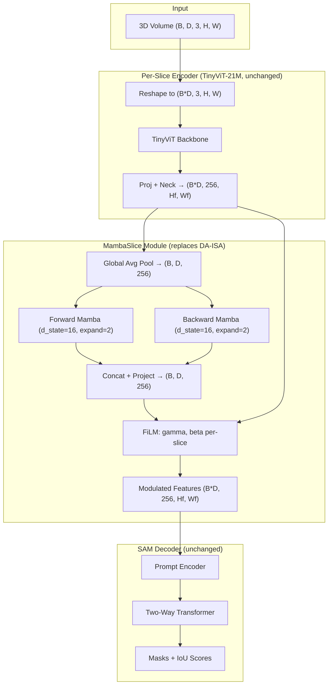
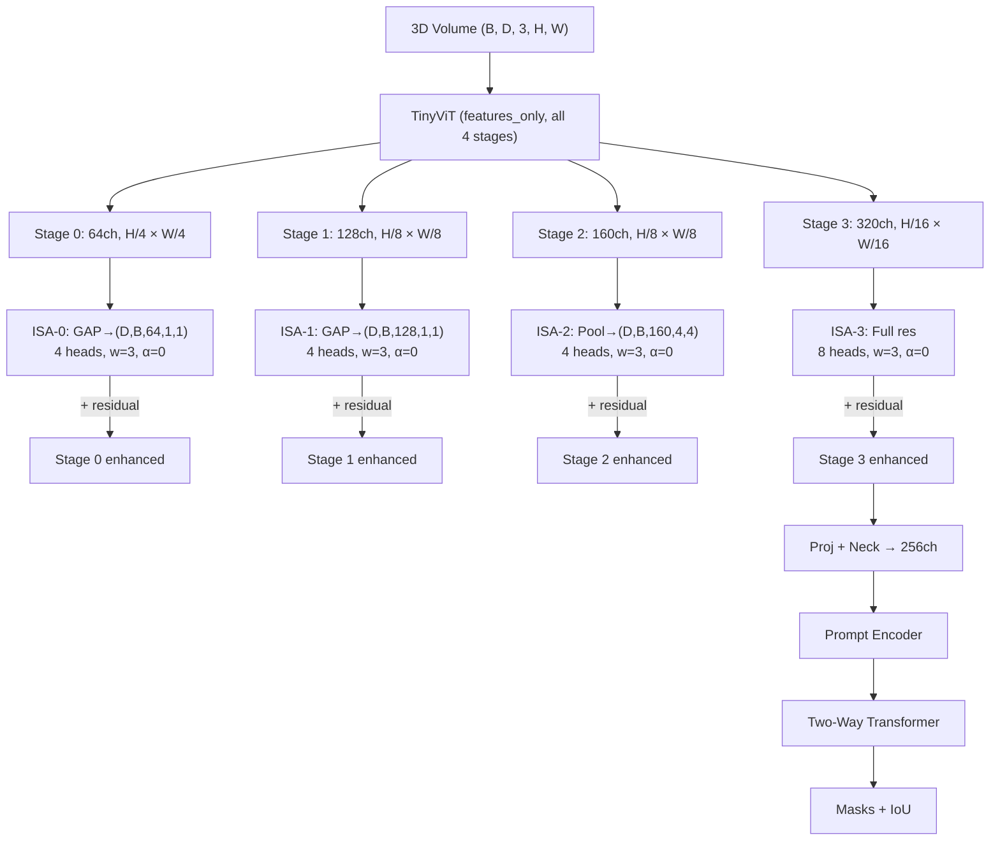
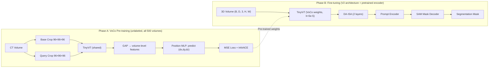
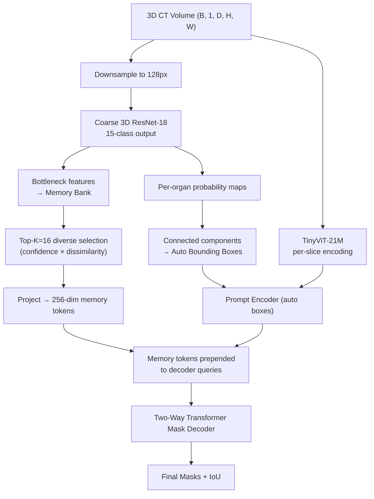
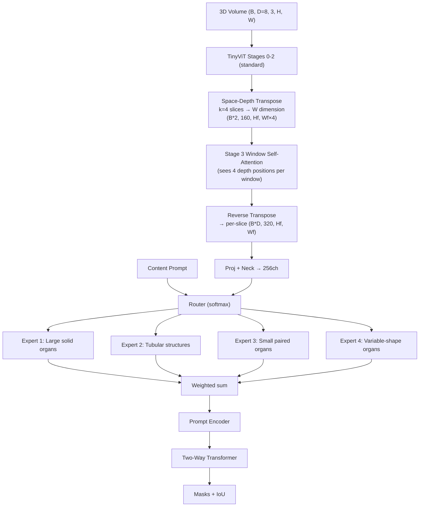

# VoluFormer3D — Detailed Architecture Designs
*Designed by Claude Opus 4.6 with extended thinking, grounded in V2 codebase analysis*

---

## Preamble: Why V2 Failed

DA-ISA added only +0.11% DSC over ISA-off (not significant). Root cause: at 256px input, TinyViT outputs 8×8 = **64 spatial tokens**. At 512px, 16×16 = **256 tokens**. Too coarse for window-3 cross-slice attention to capture meaningful inter-slice structure.

Each architecture below attacks this from a different angle. All reuse `datasets/`, `training/trainer.py`, `training/losses.py`, `evaluation/`, `evaluate_3d.py`.

---

---

# Architecture 1: MambaSlice
### SSM Cross-Slice Propagation with FiLM Depth Modulation

**Distinct from:**
- HybridMamba (MICCAI 2025): that applies Mamba inside the encoder; MambaSlice keeps TinyViT unchanged and adds Mamba POST-encoder as a 1D depth sequence
- arXiv:2602.00650: dual heavy encoders (SAM-H + VMamba); MambaSlice is single TinyViT + lightweight Mamba adapter

**Core idea:** Global average pool each slice's feature map → run bidirectional Mamba on the (B, D, 256) depth sequence → Mamba output generates (gamma, beta) for FiLM modulation of the full spatial feature maps. Bypasses coarse-token problem entirely — Mamba state propagates across D slices regardless of spatial resolution.

**Parameters:**

| Component | Params |
|-----------|--------|
| TinyViT-21M | 21.95M |
| MambaSlice (2 layers, bidir, expand=2) | ~1.6M |
| FiLM depth modulation | ~0.26M |
| Prompt Encoder | 0.20M |
| Mask Decoder | 4.22M |
| **Total** | **~28.2M** |

**Training:** 512px, batch=8, D=8, 100 epochs, lr=1e-4, cosine warmup 5 epochs. Freeze TinyViT first 10 epochs.

**Windows note:** `mamba_ssm` has `use_triton=False` since v1.2 — no Triton needed. Fallback: implement S4D-style recurrence in pure PyTorch (~50 lines).

**Expected DSC:** 89.5–91.5% | **Risk: Medium**

**Files to modify from V2:**
- `models/litesam3d.py` — replace DA-ISA with MambaSlice module
- `models/mamba_slice.py` — new file
- `configs/amos22.yaml` — swap `isa:` block for `mamba_slice:`

---

---

# Architecture 2: MultiScaleISA
### Hierarchical Cross-Slice Attention at All 4 TinyViT Stages

**Distinct from all existing work:** No SAM adaptation uses cross-slice attention at multiple TinyViT stages. V2's DA-ISA only sees Stage 4 (8×8 at 256px = 64 tokens). TinyViT has 4 stages:

| Stage | Channels | Resolution (512px input) | Tokens |
|-------|----------|--------------------------|--------|
| 0 | 64 | 128×128 | 16,384 |
| 1 | 128 | 64×64 | 4,096 |
| 2 | 160 | 64×64 | 4,096 |
| 3 | 320 | 32×32 | 1,024 |

**Strategy:** Pool Stages 0-2 to ≤16×16 before cross-slice attention (manageable cost), use full resolution for Stage 3. Zero-init residuals (`alpha=0.0`) ensure training starts from a working V2-equivalent baseline.

**Parameters:**

| Component | Params |
|-----------|--------|
| TinyViT-21M | 21.95M |
| ISA-0 (64ch, 4 heads) | ~0.05M |
| ISA-1 (128ch, 4 heads) | ~0.13M |
| ISA-2 (160ch, 4 heads) | ~0.21M |
| ISA-3 (320ch, 8 heads) | ~0.82M |
| Proj + Neck | ~0.20M |
| Prompt Encoder | 0.20M |
| Mask Decoder | 4.22M |
| **Total** | **~27.8M** |

**Training:** 256px first 50 epochs → 512px last 50 epochs. timm's `features_only=True` API extracts all 4 stage outputs.

**Expected DSC:** 89.5–92.5% | **Risk: Medium** | **Highest ceiling of all 5 ideas**

**Files to modify from V2:**
- `models/encoder.py` — change `out_indices=[3]` to `out_indices=[0,1,2,3]`
- `models/multiscale_isa.py` — new file (4 ISA blocks)
- `models/litesam3d.py` — orchestrate multi-scale ISA

---

---

# Architecture 3: VoCoSAM
### Self-Supervised CT Pre-training with Geometric Position Prediction

**Distinct from:**
- VoCo (original): used Swin backbone + nnUNet/SwinUNETR decoder. Never applied to TinyViT + SAM decoder
- SAM2-3dMed SRPP: uses inter-slice position prediction during supervised fine-tuning; VoCoSAM pre-trains on unlabeled volumes before supervised training

**Two-phase:**

**Phase A (50 epochs, no labels):** Extract random 3D crops from all 500 AMOS22 CT volumes. Train TinyViT to predict relative 3D position of one crop given another (MSE loss on (dx,dy,dz) + InfoNCE contrastive). Teaches encoder that anatomy has consistent geometric relationships.

**Phase B (100 epochs, labeled):** Standard V2 pipeline — TinyViT initialized from Phase A, DA-ISA kept, SAM decoder.

**Parameters (inference):** Same as V2 = 28.1M (position prediction head discarded after Phase A)

**Training time:** Phase A ~2-3 days, Phase B standard. Total ~5-6 days on 3090.

**Expected DSC:** 89.0–93.0% | **Risk: Medium-High** (highest upside for hard organs)

**Files to modify from V2:**
- `datasets/pretrain_dataset.py` — new: VoCo crop sampler
- `training/pretrain_trainer.py` — new: VoCo pre-training loop
- `models/litesam3d.py` — add checkpoint loading from Phase A

---

---

# Architecture 4: AutoSliceSAM
### Self-Prompting via Coarse 3D Net + Cross-Slice Memory Bank

**Distinct from:**
- MedSAM-2 (Zhu): diversity-only memory bank, no organ-type conditioning, no auto-prompting from coarse net
- EmbeddedSAM: 2D self-prompting only, no 3D memory bank
- **Key thesis value:** removes oracle bounding box dependency — makes the model clinically practical

**Two components:**

1. **Coarse 3D ResNet-18** (~4.5M): runs at 128px resolution, produces per-organ bounding boxes (auto prompts) + bottleneck features fed to memory bank
2. **Self-Sorting Memory Bank** (top-K=16 diverse slice features) — features prepended to SAM decoder's query sequence

**Parameters:** ~31.0M (4.5M coarse net + 26.5M SAM)

**Training:**
- Stage 1 (10 epochs, ~4h): Train coarse net alone at 128px
- Stage 2 (90 epochs): Freeze coarse net, train SAM with auto-boxes + memory

**Expected DSC:**
- With oracle boxes: 90.0–91.5%
- With auto-prompts: 82.0–87.0% (practical clinical performance)

**Risk: Medium-High** | **Thesis value: HIGHEST** (auto-prompting is publication gold)

**Files to modify from V2:**
- `models/coarse_net.py` — new: 3D ResNet-18
- `models/slice_memory.py` — new: diversity-sorted memory bank
- `models/mask_decoder.py` — prepend K memory tokens to decoder queries
- `datasets/amos22.py` — add `oracle_boxes=False` mode

---

---

# Architecture 5: SDTransSAM
### Space-Depth Transpose with Organ-Specific Mixture of Experts

**Distinct from:**
- Med-SA: applies SD-Trans to ViT-H (~600M params); never combined with MoE
- No existing work combines SD-Trans + organ-conditioned expert routing

**SD-Trans insight:** Reshape D=8 slices into the spatial width dimension so TinyViT's existing self-attention naturally sees cross-slice tokens — **zero new attention modules**. Just a reshape operation before Stage 3, reversed after.

**MoE insight:** Different organs have radically different 3D shapes (liver spans 100+ slices, adrenal gland spans ~10). 4 learned expert heads handle different shape categories. Router conditioned on the content prompt (already exists in V2).

**Parameters:**

| Component | Params |
|-----------|--------|
| TinyViT-21M + SD-Trans (reshape only) | 21.95M |
| SD-Trans adapter (pre/post proj) | ~0.33M |
| MoE (4 experts, 2-layer MLP) | ~0.53M |
| MoE router | ~0.01M |
| Prompt Encoder | 0.20M |
| Mask Decoder | 4.22M |
| **Total** | **~27.2M** — *lightest of all 5* |

**Training:** 512px, batch=4, D=8, 100 epochs. Add MoE auxiliary load-balancing loss (weight=0.01) to prevent expert collapse.

**Windows note:** SD-Trans is a pure tensor reshape (`view` + `permute`) — zero external dependencies.

**Expected DSC:** 89.5–92.5% | **Risk: Medium**

**Files to modify from V2:**
- `models/encoder.py` — insert SD-Trans before/after Stage 3
- `models/organ_moe.py` — new: 4-expert MoE layer
- `models/litesam3d.py` — add MoE between encoder and decoder

---

---

## Implementation Order (Opus Recommendation)

1. **MultiScaleISA** — directly addresses root cause (coarse features), no new deps, uses V2 ISA code
2. **SDTransSAM** — elegant, no new deps (just reshapes), MoE is a clean publishable contribution
3. **MambaSlice** — novel Mamba angle, validate mamba-ssm on Windows early
4. **VoCoSAM** — highest upside but longest wall-time (pre-training phase)
5. **AutoSliceSAM** — most impactful for thesis but most complex

## Final Comparison

| | MambaSlice | MultiScaleISA | VoCoSAM | AutoSliceSAM | SDTransSAM |
|--|-----------|-------------|--------|------------|-----------|
| **Params** | 28.2M | 27.8M | 28.1M | 31.0M | 27.2M |
| **Risk** | Med | Med | Med-High | Med-High | Med |
| **Expected DSC** | 89.5-91.5% | 89.5-92.5% | 89.0-93.0% | 82-91.5% | 89.5-92.5% |
| **Impl time** | 1.5 wk | 2 wk | 2.5 wk | 3 wk | 2 wk |
| **Ext. deps** | mamba-ssm | None | None | None | None |
| **Thesis value** | High | High | Very High | Very High | High |

---
* — 2026-04-09*
