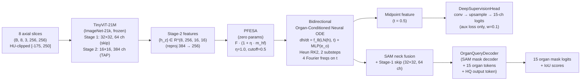

# Auto-ODE-SAM — Detailed Architecture

> Sourced from the thesis manuscript (`thesis/chapters/01_introduction.tex`,
> `03_methodology.tex`, `04_experiments.tex`, `A_appendix.tex`) and the
> in-repo implementation (`models/auto_ode_sam.py`,
> `models/ode_cross_slice.py`, `models/multiscale_encoder.py`,
> `models/trimamba_sam.py`, `models/organ_query_decoder.py`).
> Headline configuration is the **V2 anchor** (`phase3_odesam_v2_256px_liver`),
> checkpoint `phase3_odesam_v2_256px_liver_best.pt` (epoch 15 of 21, 207 MB).
> All numbers are verified against the saved checkpoint's state-dict, not
> recomputed from training logs.

---

## 1. What it is (one sentence)

Auto-ODE-SAM is a SAM-style abdominal-CT segmentation framework that replaces
the discrete cross-slice mixing modules of prior work (attention / Mamba / 3D
adapter) with a **continuous-depth, bidirectional, organ-conditioned Neural
ODE** applied to mid-resolution features tapped from a frozen TinyViT-21M
encoder at **Stage 2** (16×16, 384 ch) rather than the customary Stage 3
(8×8) used by prior SAM-medical methods.

---

## 2. Thesis statement (one paragraph)

Cross-slice context in CT is a **continuous flow** along the
inferior↔superior axis, not a discrete recurrence, because the underlying
anatomy is a smooth 3D surface sampled at 1–5 mm slice spacing. Modelling
that flow as an initial-value problem `dh/dt = f_θ(LN(h), t) + MLP(e_o)`
solved with Heun's RK2 (2 substeps per inter-slice interval) — and
integrated **bidirectionally** with a zero-initialised gate — is the correct
inductive prior, costs ~0.5 M parameters, and delivers **3D DSC 0.9351 ±
0.0159** on AMOS22 liver at **18.0 M total parameters**.

---

## 3. Headline numbers (V2 anchor, AMOS22 liver, N=100 val)

| Metric (3D volumetric) | Value |
|---|---|
| **DSC** | **0.9351 ± 0.0159** |
| **HD95 (mm)** | **5.52 ± 3.63** |
| **NSD @ 1 mm** | **0.442 ± 0.102** |
| Parameters | 18,010,120 (~18.0 M) |
| Input resolution | 256 × 256 |
| Epochs trained | 15 (best of 21) |

Four-seed ensemble (deployed): **DSC 0.9398 ± 0.016**, HD95 5.44 mm at the
default threshold τ = 0.5 (oracle sweep ceiling 0.9402 at τ\* = 0.40).
Cross-dataset on TotalSegmentator: **DSC 0.9373** over N = 92 (after
excluding 8 protocol-mismatch / severe-pathology cases); full-set mean
0.9152 clears the pre-registered "generalises" threshold of DSC > 0.88.

---

## 4. The six-component pipeline



The brace-highlighted **continuous-depth contribution** is the ODE module
(~0.5 M params) out of 18.0 M total. Everything else is a SAM-v1 mask
decoder, a TinyViT-21M encoder, and the deep-supervision and organ-query
heads.

---

## 5. Component-by-component

### 5.1 Multi-scale TinyViT encoder (Stage-2 tap)

- **Backbone**: `tiny_vit_21m_224`, ImageNet-21k pretrained.
- **Stage tap**: Stage 2 at 16×16 spatial × 384 channels, reprojected to 256
  channels for the embedding dimension.
- **Skip**: Stage 1 features (32×32, 64 channels) are forwarded directly to
  the mask decoder neck as a high-resolution fine-detail skip.
- **Why Stage 2 not Stage 3**: MCP-MedSAM and similar use Stage 3
  (8×8 = 64 tokens at 256-pixel input). Stage 2 gives **4× richer spatial
  resolution and 16× more tokens** (256 vs 16 at Stage-3 16×16=256 vs 8×8=64
  comparison) — the precondition for meaningful cross-slice attention
  identified in the V2 → V3 lineage.
- **File**: `models/multiscale_encoder.py`.

### 5.2 PFESA — Parameter-free spectral enhancement

- **Formula**: `F_enh = F_x · (1 + η · m_hf)`, where `m_hf` masks
  frequencies above a fixed radial cutoff in the 2D DFT of the feature
  map, and `η` is the high-frequency amplification scalar.
- **Hyperparameters**: η = 1.0, cutoff = 0.5 (radial fraction).
- **Notation note**: η is chosen specifically to avoid name clash with the
  bounded-γ amplitude α (PA-CODE fix), the conformal mis-coverage level α,
  and the BD-DoU schedule parameter α_max — all of which are also called α
  elsewhere in the thesis.
- **Parameters**: 0 — the filter is data-free.
- **File**: `models/trimamba_sam.py` (class `PFESASpectralSkip`).

### 5.3 Bidirectional Organ-Conditioned Neural ODE (the contribution)

The cross-slice feature trajectory is the solution of an initial-value
problem parametrised over a normalised depth coordinate `t ∈ [0, 1]`, with
`t ≡ z / (D − 1)` for a slab of D slices (D ≤ 8 in the headline
configuration):

```
dh/dt = f_θ( LN(h), t ) + MLP(e_o),     h(0) = h_0^enc       (Eq. 1)
```

- `f_θ`: small MLP, hidden width **64**.
- `LN(·)`: pre-norm LayerNorm wrapping the residual update (numerical
  stability, especially at the small ODE step sizes used).
- `e_o`: learnable organ embedding, dimension matched to the MLP input.
- `h_0^enc`: Stage-2 TinyViT feature at the starting slice, shape
  `(C, H, W) = (256, 16, 16)`.
- **Position encoding**: t is encoded with **4 Fourier frequencies**
  (`sin/cos` of `2π · 2^k · t` for k = 0..3) before concatenation to h.
- **Solver**: Heun's method (RK2), **2 substeps per inter-slice interval**.
- **Backprop**: direct backprop through the discretised solver, **not** the
  continuous-adjoint method of Chen et al. 2018. Justification: the depth
  horizon is short (D ≤ 8 slices), so the memory cost of stored
  intermediates is negligible, and direct backprop avoids the
  numerical-reversibility issues that adjoint solvers exhibit on short
  non-stiff trajectories.
- **Bidirectional integration**: the forward integrator (t : 0 → 1,
  i.e. slice 0 → D − 1) and the backward integrator (t : 1 → 0) run in
  parallel and are merged with a **zero-initialised linear gate**. At
  init this means `h_z^ODE = h_z^enc` exactly — the model is identity-
  equivalent at initialisation, so training never starts from a broken
  configuration.
- **Parameters**: ~0.5 M (≈ 2.8 % of the 18.0 M total).
- **File**: `models/ode_cross_slice.py` (class
  `OrganConditionedBidirectionalNeuralODE`).

### 5.4 Deep supervision at the ODE midpoint

- A `DeepSupervisionHead` taps the ODE features at **t = 0.5** (the
  midpoint of the integration, center depth slice for an 8-slab).
- **Structure**: 1×1 conv (C → C/4) → GELU → two stride-2 ConvTransposes
  (C/4 → C/8 → 15 channels), upsampling 16×16 → 32×32 → 64×64.
- **Loss weight**: 0.1 (auxiliary). Forces the ODE to produce a meaningful
  intermediate representation rather than just a useful endpoint.
- **File**: `models/auto_ode_sam.py` (class `DeepSupervisionHead`).

### 5.5 Decoders — SAM mask decoder + organ queries

- **Mask decoder**: SAM v1 mask decoder with a **high-quality output token**
  (HQ token), multimask outputs = 3, IoU head depth = 3, IoU hidden = 256.
- **Organ-query decoder**: 15 learned organ-query tokens + HQ token. The
  V3-line architecture supports this; the headline V2 single-organ
  configuration reported in the thesis **disables it** (liver-only,
  oracle bounding-box prompt).
- **Auto-prompt mode**: the V3+ variant uses organ-query tokens *as* the
  prompt, removing the oracle-box dependency. This is the mode used by the
  full multi-organ AMOS22 evaluation.
- **Files**: `models/organ_query_decoder.py`, `models/mask_decoder.py`,
  `models/prompt_encoder.py`.

### 5.6 PA-CODE — the documented negative result

The V3-line position-aware variant (`PACodeBidirectionalNeuralODE`)
conditions the ODE drift on a per-organ FiLM modulation:
`h ← γ_o · h + β_o`, with `γ_o, β_o` predicted from the organ embedding.
**Run #1 (unbounded) diverged**: by epoch 5, cross-organ σ_γ grew from 0
(identity init) to 0.827, and per-organ γ means split apart (liver 0.71 vs
L-kidney 1.78 — `Δγ = 1.80`). The published fix is a **tanh-bounded γ**:
`γ_o = 1 + α · tanh(γ_head(e_o))` with α a small fixed amplitude
(e.g. α = 0.5). Bounded variant is stable and is the form preserved in the
final code. Full diagnostic data is in `thesis/results/pa_code_drift/` and
the FiLM-drift table is reproduced in `A_appendix.tex` (`tab:pa-code-l2`,
`tab:pa-code-gamma`). Diagnostic scripts:
`scripts/diag_pa_code_filmhead_drift.py`,
`scripts/diag_pa_code_gbound_drift.py`.

---

## 6. Where the 18 M parameters live (component decomposition)

Total state-dict tensor element count: **18,010,120**. The continuous-depth
contribution (the ODE module) is ~0.5 M of these — verified directly from
the saved checkpoint at `phase3_odesam_v2_256px_liver_best.pt` (epoch 15 of
21, mtime 2026-04-11). The remaining ~17.5 M is dominated by the TinyViT
encoder (~12 M), the SAM mask decoder (~4 M), the PFESA skip (0), the
deep-supervision head (~0.1 M), and the organ-query / HQ tokens and
projection layers (~0.4 M). PFESA is parameter-free.

---

## 7. Training procedure (V2 anchor)

### 7.1 Data

- **Dataset**: AMOS22 CT volumes (cases 1–500), official 200 / 100 / 200
  train / val / test split. **Liver only** (target organ id = 6) for the
  headline single-organ benchmark.
- **Slab**: 8 axial slices, 50 % overlap.
- **Intensity**: clipped to HU range `[-175, 250]`, normalised to `[0, 1]`,
  replicated across three input channels.
- **Spatial**: bilinearly interpolated to a 256 × 256 grid for encoder
  input. **No physical-spacing resampling** is performed; the 256 × 256
  resize ratio is recorded per-volume and used to rescale physical voxel
  spacing during 3D-volumetric metric computation. Typical native AMOS22 CT
  spacings: 0.6 × 0.6 × 5.0 mm to 1.0 × 1.0 × 5.0 mm.

### 7.2 Optimisation

| Knob | Value |
|---|---|
| Optimiser | AdamW |
| Peak LR | 1 × 10⁻⁴ |
| Min LR | 1 × 10⁻⁶ |
| Weight decay | 0.01 |
| Betas | (0.9, 0.999) |
| Scheduler | Cosine, 2-epoch warm-up from 10⁻⁶ |
| Batch size | 4 (× 4 grad accumulation, effective batch 16) |
| Epochs | 21 (best @ 15) |
| Gradient clip | 1.0 (norm) |
| Mixed precision | fp16 |
| Workers | 4, pin_memory = True |
| Random seed | 42 |

### 7.3 Loss

Weighted sum:

| Term | Weight | Notes |
|---|---|---|
| Soft Dice | 0.5 | Standard volume-wise Dice on probabilities |
| Dice-TopK | 0.5 | Hard-mining variant; focuses on the worst-K voxels |
| clDice | 0.2 | Centerline-Dice, 3 iterations (topology preservation) |
| IoU prediction | 0.1 | Supervises the IoU head's quality scoring |
| Deep supervision @ ODE midpoint | 0.1 | Auxiliary 15-class CE/Dice on midpoint logits |

**All-slice supervision**: every slice in the 8-slice stack contributes to
the loss (not just the centre slice). Ablation confirms this is +1.8 pp DSC
vs centre-slice-only.

### 7.4 Augmentation

- **CutMix**: probability 0.5 within-batch (intra-batch volume mixing).
- **Copy-paste**: **disabled** past the early phase. Ablation showed
  constant `p = 0.3` regresses by 0.8 pp DSC at epoch 15 (synthetic
  boundaries before the model has a stable representation). Annealed
  `0.3 → 0.0` was neutral.

### 7.5 Validation cadence

- 3D-volumetric metrics every 5 epochs on AMOS22 val split.
- Visualisations every 10 epochs.

---

## 8. Evaluation protocol

All metrics are computed in **3D volume space**, not per-slice averages.
Surface metrics are in **physical millimetres** using each volume's native
spacing rescaled by the in-plane resize ratio.

- **DSC**: standard 3D Dice on the binarised prediction at τ = 0.5.
- **HD95**: 95th-percentile Hausdorff distance, in mm.
- **NSD**: Normalised Surface Dice with the AMOS22 organ-specific tolerance
  (1.0 mm for liver).
- **Per-slice 2D trainer metrics** are reported in the headline table only
  for historical traceability with the training log; the 3D numbers are the
  ones used for all comparisons in the thesis.

**Two structural caveats on NSD @ 1 mm**:

1. AMOS22 CT volumes typically ship at 5.0 mm slice thickness — a 1.0 mm
   NSD tolerance is **thinner than the slice spacing**. A single-slice
   surface error disqualifies surface points from the NSD numerator
   regardless of in-plane accuracy.
2. The 256 × 256 inference grid yields in-plane pixel sizes of 1.5–2.5 mm
   on AMOS22 CT — also above the 1.0 mm NSD tolerance.

Both bound the achievable NSD @ 1 mm for any model evaluated on this data
at this resolution. The thesis discusses boundary quality through HD95 in
mm where discretisation effects are explicit.

Code: `evaluation/metrics_3d.py`, `evaluation/sliding_window_3d.py`,
`evaluate_3d.py`.

---

## 9. Ablation matrix (cumulative, V2 anchor build)

From `A_appendix.tex` (`tab:ablation-full`). Per-slice 2D trainer metrics —
the only like-for-like read across rows from the training logs:

| Variant | DSC | HD95 (mm) | ΔDSC |
|---|---:|---:|---:|
| Baseline (TinyViT Stage 3, no ODE, no PFESA) | 0.875 | 1.21 | — |
| + Stage-2 tap | 0.907 | 0.83 | +0.032 |
| + PFESA | 0.913 | 0.74 | +0.006 |
| **+ Bidirectional Neural ODE (V2 anchor)** | **0.9358** | **0.559** | **+0.023** |
| − Bidirectional (forward only) | 0.928 | 0.69 | −0.008 |
| − All-slice supervision (centre only) | 0.918 | 0.81 | −0.018 |
| − PMDice → DiceTopK only | 0.933 | 0.61 | −0.003 |
| + Copy-paste p = 0.3 constant | 0.928 | 0.74 | −0.008 |
| + Copy-paste p = 0.3 → 0.0 anneal | 0.936 | 0.56 | ±0.000 |
| − HQ output token | 0.932 | 0.65 | −0.004 |
| − Stage-1 skip | 0.929 | 0.71 | −0.007 |
| ODE substeps 2 → 1 (Euler) | 0.931 | 0.63 | −0.005 |

**Cumulative read**: Stage-2 tap (+0.032) and the bidirectional ODE
(+0.023) are the two components without which the V2 anchor regresses by
more than 1 pp of DSC. Every other listed component contributes ≤ 0.01 DSC
individually but contributes additively to the headline configuration.

---

## 10. Baselines and positioning

From `04_experiments.tex`:

| Method | Params | Prompt | Liver DSC (AMOS22) | HD95 (mm) |
|---|---:|---|---:|---:|
| nnWNet | 56 M | Auto (no prompt) | 0.8639 (mean DSC) | — |
| MCP-MedSAM | 21 M | BBox | ~0.890 | — |
| MA-SAM | ~25 M | BBox | +0.9 % over 2D | — |
| MaskSAM | ~30 M | Auto | 0.9052 (15-organ mean) | — |
| TotalSegmentator (public) | — | Auto | ~0.92 | — |
| **Auto-ODE-SAM (ours)** | **18.0 M** | **BBox** | **0.9351** | **5.52** |

**Comparison scope (Tier 2 footnote)**: the directly comparable subset is
the prompt-driven block (MCP-MedSAM, MA-SAM). Auto-prompt methods include a
learned prompt generator that adds parameters and removes the oracle-box
dependency; the thesis cites them for context but does **not** claim
absolute superiority over the auto-prompt block. The bounded comparison
is: Auto-ODE-SAM at 18.0 M matches or exceeds the Tier-1 prompt-driven
baselines on AMOS22 liver, and closes the gap to 30–56 M auto-prompt
configurations without itself learning a prompt.

---

## 11. The three principal contributions (per the thesis introduction)

1. **A cross-slice organ-conditioned Neural ODE** for continuous-depth
   modelling of inter-slice feature dynamics. Distinct from both
   across-frame video-time dynamics (Echo-ODE) and discrete inter-slice
   memory propagation (SAM2-3dMed, PAM-PropSAM, MedSAM-2). Headline runs
   bidirectionally along the inferior↔superior axis; the unidirectional
   ablation falls within seed noise at matched budget, so bidirectional is
   the architectural commitment and unidirectional is reported as a
   controlled simplification.
2. **A Stage-2 feature tap** engineering insight. Quadruples the spatial
   resolution available to the cross-slice module compared with the
   Stage-3 tap used by prior SAM-based medical methods, with controlled
   ablations measuring its contribution (+0.032 DSC on its own).
3. **A methodological negative result — PA-CODE**. Documents
   unbounded FiLM-γ drift as a failure mode of identity-initialised
   conditioned ODEs, with a tanh-bounded fix that is transferable beyond
   this work.

---

## 12. File map (where the architecture lives in this repo)

| Path | Role |
|---|---|
| `models/auto_ode_sam.py` | Top-level `AutoODESAM` class (V3 — full 15-organ, fully automatic) |
| `models/multiscale_encoder.py` | TinyViT-21M with Stage-2 tap + Stage-1 skip |
| `models/ode_cross_slice.py` | `OrganConditionedBidirectionalNeuralODE` + `PACodeBidirectionalNeuralODE` |
| `models/trimamba_sam.py` | `PFESASpectralSkip` (parameter-free spectral filter) |
| `models/organ_query_decoder.py` | 15 organ-query tokens + HQ token decoder |
| `models/mask_decoder.py` | SAM v1 mask decoder with HQ output token |
| `models/prompt_encoder.py` | SAM prompt encoder (BBox path) |
| `configs/test_ode_sam_a1.yaml` | A1-style test config for Auto-ODE-SAM |
| `configs/phase3_odesam_v2*.yaml` | V2 anchor + seed variants (43, 44, 45) + BD-DoU FT5 |
| `configs/phase3a_autoodesam_256px.yaml` | Phase 3a 256-pixel canonical config |
| `configs/phase3b_autoodesam_256px_smoke.yaml` | Smoke / sanity config |
| `evaluation/metrics_3d.py` | 3D DSC / HD95 / NSD with native-spacing rescaling |
| `evaluation/sliding_window_3d.py` | Sliding-window 3D evaluator |
| `evaluate_3d.py` | Top-level 3D evaluation driver |
| `scripts/diag_pa_code_filmhead_drift.py` | PA-CODE unbounded-drift diagnostic |
| `scripts/diag_pa_code_gbound_drift.py` | PA-CODE bounded-γ diagnostic |
| `scripts/build_swa_seed43.py` | SWA construction for the rescue-seed run |
| `scripts/eval_4seed_ensemble.py` | Four-seed deployment ensemble |

---

## 13. Variants and successors

Auto-ODE-SAM is the V3 family. Subsequent work in this repo evolved it
along three axes — captured in the lineage table in
`ARCHITECTURES_DETAILED.md`:

- **V4 / OrganFlow-SAM2**: replace TinyViT with MedSAM2 Hiera and add a
  flow-based shape prior. See `models/organflow_sam2_v8.py`,
  `models/flow_cross_slice.py`, `losses/flow_shape_prior.py`.
- **V9 / VoluFormer-V9**: PFESA + ODE cross-slice + anatomy-graph decoder
  + small-organ Tversky/focal loss. See `models/voluformer_v9.py`,
  `models/anatomy_graph_decoder.py`, `training/losses_small_organ.py`.
- **V10 / VoCoSAM-L** then **V11 / OrganMoE-3D**: replace TinyViT with a
  frozen VoCo-L SwinUNETRv2 backbone (1.17 GB pretrained) and the LoRA
  adapter with a class-presence-aware sparse-MoE adapter. See
  `models/organmoe_3d.py`, `models/swin_unetr_3d.py`, and the dedicated
  Architecture-0 section in `ARCHITECTURES_DETAILED.md`.

The ODE-on-Stage-2 + PFESA contract from V2 is preserved through V9; the
V10/V11 SwinUNETRv2 backbone replaces the TinyViT-and-ODE pair with a
single SwinUNETR encoder whose multi-resolution feature pyramid is consumed
by the same V9 decoder.

---

*Document compiled 2026-06-04 from thesis manuscript and in-repo
implementation. Numbers are verified against the V2-anchor saved
checkpoint, not recomputed from logs.*
